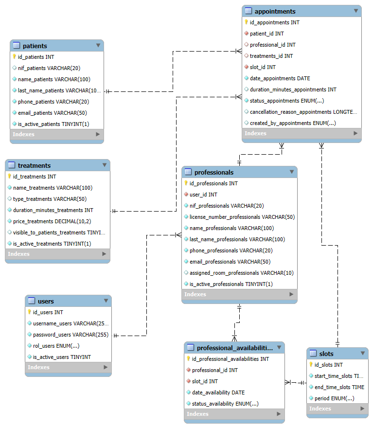

# SYMYLE - CLÍNICA DENTAL / Documentación Completa

**Autor:** Fran Ramírez

## Resumen ejecutivo
Esta documentación actúa como README y memoria técnica del proyecto Dental Clinic — una aplicación web para la gestión integral de una clínica dental. Incluye arquitectura, BD, backend, frontend, API, capturas y más.

## Índice
1. Resumen ejecutivo
2. Requisitos
3. Instalación
4. Modelo de datos
5. Backend
6. Frontend
7. Seguridad
8. API REST
9. MongoDB
10. Capturas
11. Mejoras futuras

## 1. Arquitectura General
- Angular 17 Frontend
- Spring Boot 3 Backend
- MySQL para datos principales
- MongoDB para módulo académico
- JWT para autenticación

## 2. Instalación
### Backend
mvn clean install
mvn spring-boot:run

### Frontend
npm install
ng serve --open

## 3. Base de Datos MySQL
Incluye tablas:
- users
- professionals
- patients
- slots
- availabilities
- appointments
- treatments

**Diagrama de Entidad-Relación (DER)**

## 4. MongoDB
Colección: user_birthdates

## 5. Backend
Patrón en capas:
- controller
- service
- repository
- dto
- security

## 6. Frontend
Angular con componentes:
- agenda diaria
- agenda semanal
- citas
- pacientes
- profesionales

## 7. Seguridad
JWT, roles, guards.

## 8. API REST
Endpoints principales incluidos (auth, users, professionals, appointments, availabilities...). Compatible con Swagger.

## 9. Capturas
Colocar en src/assets/screenshots:
- swagger.png
- agenda-semanal.png
- dashboard.png
- citas-list.png
- login.png

## 10. Mejoras futuras
- Paginación
- Tests automáticos
- Despliegue en Docker
